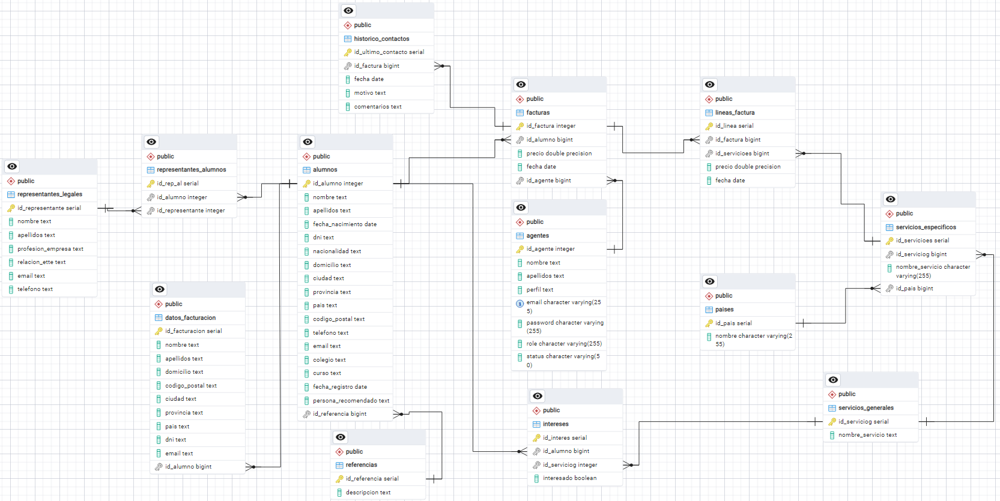

# Desafío Tripulaciones Data Science

El proyecto Admin Dashboard es una aplicación web diseñada para proporcionar una plataforma centralizada para la gestión de datos relacionados con alumnos, representantes legales, facturación y más. Su objetivo principal es facilitar la administración y el análisis de información crucial para la empresa Beyond_Education.

## Objetivos del Proyecto

El objetivo principal de este proyecto es desarrollar una herramienta intuitiva y eficiente que permita a los usuarios realizar las siguientes tareas:

* **Gestión de Alumnos:** Permitir el registro y la gestión de información detallada sobre los alumnos, incluyendo datos personales, detalles de contacto, historial de llamadas con el mismo y más.

* **Registro de Representantes Legales:** Facilitar la administración de representantes legales asociados a los alumnos, incluyendo información de contacto y relación con el alumno.

* **Gestión de Facturación:** Automatizar el proceso de generación y seguimiento de facturas, así como la gestión de datos relacionados con la facturación y pagos.

* **Análisis de Datos:** Proporcionar herramientas de análisis y visualización de datos para obtener insights útiles a partir de la información recopilada.

## Características Principales

* **Interfaz Intuitiva:** La aplicación cuenta con una interfaz de usuario amigable y fácil de usar, diseñada para que usuarios de todos los niveles de experiencia puedan navegar y utilizar las funciones de manera eficiente.

* **Personalización:** Se ofrece la posibilidad de personalizar y adaptar la aplicación según las necesidades específicas de cada usuario o institución, permitiendo la configuración de campos personalizados, preferencias de visualización y más.

* **Seguridad:** Se implementan medidas de seguridad robustas para proteger la integridad y confidencialidad de los datos almacenados en la aplicación, incluyendo autenticación de usuarios, cifrado de datos y auditorías de acceso.

* **Escalabilidad:** La aplicación está diseñada para ser escalable y capaz de manejar grandes volúmenes de datos, lo que la hace adecuada para su uso en instituciones educativas y organizaciones de diferentes tamaños.

## Tecnologías Utilizadas
El proyecto Admin Dashboard se desarrolla utilizando una combinación de tecnologías de vanguardia, que incluyen:

* **Python:** Se utiliza como lenguaje principal de programación para el desarrollo del backend de la aplicación, así como para tareas de análisis de datos y scripting.

* **Streamlit:** Es el framework utilizado para el desarrollo del frontend de la aplicación, permitiendo la creación de interfaces de usuario interactivas y visualmente atractivas.

* **PGAdmin4 / PostgreSQL:** Se emplea para la gestión y manipulación de datos en la base de datos relacional utilizada por la aplicación, permitiendo consultas eficientes y seguras.

* **Render:** Se ha utilizado para el alojamiento de la base de datos en la nube.


## Estructura del proyecto

    desafio_tripulaciones_ds/
    │
    ├── img/                          # Carpeta que contiene las imágenes utilizadas en la aplicación
    │   ├── bye.png
    │   ├── facturacion.png
    │   └── intro.png
    ├── sql/                          # Carpeta que contiene las queries de la creación de la bbdd y la ingesta de datos
    │   └── queries.sql               # Fichero con las queries para la creación de las tablas y la ingesta de datos
    ├── src/    
    │   ├── app.py                    # Archivo principal de la aplicación Streamlit
    │   ├── funciones.py              # Funciones auxiliares para la obtención y manipulación de datos
    │   └── .streamit/                # Carpeta para almacenar el fichero secrets.txt
    │       └── secrets.txt           # Fichero para almacenar las credenciales para conectar con la bbdd
    ├── requirements.txt              # Lista de dependencias del proyecto
    ├── .gitignore                    
    └── README.md                     # Archivo de documentación del proyecto

## Descripción de la base de datos

La base de datos centraliza la información relacionada con la gestión de alumnos, servicios educativos, facturación y relaciones con los clientes en un centro educativo.




### Entidades:

* **Representantes Legales:** Almacena información sobre los representantes legales de los alumnos (nombre, apellidos, profesión, relación con el alumno, email, teléfono).
* **Agentes:** Almacena información sobre los agentes del centro educativo (nombre, apellidos, perfil, email, contraseña, rol, estado).
* **Alumnos:** Almacena información sobre los alumnos del centro educativo (nombre, apellidos, fecha de nacimiento, DNI, nacionalidad, domicilio, ciudad, provincia, país, código postal, teléfono, email, colegio, curso, fecha de registro, persona que recomendó, referencia).
* **Países:** Almacena información sobre los países de residencia o nacionalidad (nombre).
* **Servicios Generales:** Almacena información sobre las categorías generales de servicios educativos (nombre del servicio).
* **Servicios Específicos:** Almacena información sobre los servicios educativos específicos dentro de las categorías generales (nombre del servicio, servicio general al que  pertenece, país donde se ofrece).
* **Datos Facturación:** Almacena información de facturación para los alumnos (nombre, apellidos, domicilio, código postal, ciudad, provincia, país, DNI, email, alumno al que  pertenece).
* **Facturas:** Almacena información sobre las facturas generadas (alumno, precio, fecha, agente).
* **Líneas Factura:** Almacena detalles de los servicios incluidos en cada factura (factura a la que pertenece, servicio específico, precio, fecha).
* **Histórico Contactos:** Almacena registro de interacciones con los clientes relacionadas a las facturas (factura, fecha, motivo, comentarios).
* **Referencias:** Almacena información sobre las personas o entidades que recomiendan a los alumnos (descripción).
* **Intereses:** Almacena información sobre los intereses de los alumnos en los servicios educativos (alumno, servicio general, si está interesado).
* **Representantes Alumnos:** Tabla auxiliar para la relación de muchos a muchos entre representantes legales y alumnos.

## Descripción del Dashboard

El panel de control que se desplegará a través de Streamlit proporciona las siguientes funcionalidades:

- **Home:** Página de inicio con una imagen de presentación.
- **Facturación:** Gráficos que muestran la evolución de la facturación, servicios más contratados, distribución de facturación por agente y ventas por país de origen.
- **Distribución global del cliente:** Mapa de burbujas que muestra la distribución de los clientes a nivel global.
- **Intereses Clientes:** Visualización de los intereses de los clientes en diferentes servicios, con posibilidad de filtrar por edad y país.
- **Histórico Interacciones:** Gráfico de pastel que muestra la distribución de interacciones con los clientes según diferentes motivos.
- **Referencias:** Gráfico de pastel que muestra cómo los clientes conocieron la empresa, con posibilidad de filtrar por país.

## Requisitos

- Python 3.8+
- PostgreSQL
- Librerías Python: Streamlit, Pandas, Numpy, Matplotlib, Seaborn, Plotly, Psycopg2, Python-dotenv, Pillow.
- PGAdmin 4
- Servidor SQL alojado en Render

## Instalación

1. Clonar el repositorio:

   ```bash
   git clone https://github.com/JavierCalderon94/desafio_tripulaciones_ds/git

2. Crear y activar una base de datos alojada en Render.

3. Dentro de la carpeta src/ se deberá crear una carpeta llamada `.streamlit` y dentro de la misma un fichero llamado `secrets.txt`. 
    
    Este fichero contendrá las credenciales de la bbdd, la estructura de las credenciales deberá estar de la siguiente forma:
     ```bash
    [env]
    host = "introducir"
    port = "introducir"
    dbname = "introducir"
    user = "introducir"
    password = "introducir"

4. A través de pgAdmin 4 conectar con la BBDD y ejecutar el fichero ´sql/queries.sql´ para crear las tablas y datos de la bbdd.

5. Iniciar el fichero `app.py` desde la ruta del mismo:
     ```bash
    streamlit run .\app.py
    
## Uso


Al iniciar la aplicación, se mostrará un menú lateral con las diferentes opciones disponibles. Cada opción desplegará gráficos interactivos que permitirán analizar los datos de manera visual y sencilla. Los gráficos pueden ser filtrados utilizando los menús desplegables y checkboxes en el panel lateral.